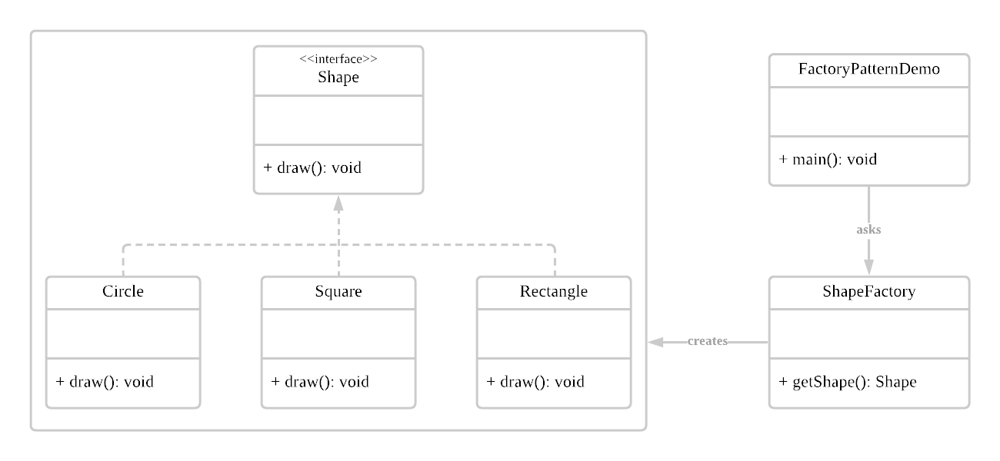

# 팩토리 메서드 <sub>Factory Method</sub>

팩토리 메서드 패턴은 **인터페이스** 로 객체들을 정의하고, 팩토리가 객체를 생성하는 패턴이다.

* 객체 생성 코드를 분리하여 클라이언트 코드와 결합도(의존성)를 낮춤
  * 코드에 변경이 필요할 시, 객체 생성 클래스만 수정하면 된다. 
* 객체의 자료형이 하위 클래스에 의해 결정됨
  * 확장에 용이함
  * 상위 클래스에서 그 객체의 정확한 타입을 몰라도 된다. 
* **SOLID 원칙 중 DIP (Dependency Inversion Principle, 의존 관계 역전 원칙)를 성립함**

## 구조


## 코드

1. 메인

```java
//FactoryPatternDemo.java

public class FactoryPatternDemo {
    public static void main(String[] args) {
        //Shape 객체를 생성해주는 팩토리를 만든다.
        ShapeFactory shapeFactory = new ShapeFactory();

        //팩토리 메서드를 통해 객체를 생성한다. 
        Shape shape1 = shapeFactory.getShape("CIRCLE");
        shape1.draw();

        Shape shape2 = shapeFactory.getShape
        shape2.draw();
    }
}
```

2. 팩토리에서 만들어낼 상품들

```java
//Shape.java

//Shape는 상위 클래스(인터페이스)로, 서브 클래스들은 모두 이에 의존하게 된다. 
public interface Shape {
    void draw();
}
```

```java
//Circle.java

public class Circle implements Shape {

    @Override
    public void draw() {
        System.out.println("Inside Circle::draw() method.");
    }
}
```

```java
//Rectangle.java

public class Square implements Shape {

    @Override  
    public void draw() {
        System.out.println("Inside Rectangle::draw() method.");
    }
}
```

3. 이 상품들을 만들어 내보낼 팩토리
```java
//ShapeFactory.java

public class ShapeFactory {

    //getShape()를 통해 상품(Shape)을 새로 만들어 내보낸다.
    public Shape getShape(String shapeType) {
        if(shapeType.equalsIgnoreCase("CIRCLE")) 
            return new Circle();
        
        else if(shapeType.equalsIgnoreCase("RECTANGLE"))
            return new Rectangle();
        
        else return null;
    }
}
```

<br/>
<br/>

## Reference
* https://dailyheumsi.tistory.com/150?category=855210