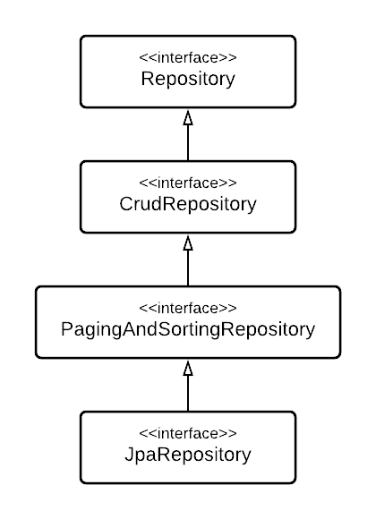

# Repository: Spring Data JPA의 핵심

## 1. JPA와 Spring Data JPA

## JPA

일반적으로 백엔드 API라 함은 클라이언트가 어떻게 서버를 사용해야 하는지를 정의한 기술 명세를 뜻한다. 그리고 JPA는 `Java Persistence API`의 약자이다. 여기서 우리는 JPA의 정체를 추측해볼 수 있다. **JPA는 자바 진영에서 어떻게 관계형 데이터베이스를 사용해야 하는지를 정의한 기술 명세이다.**        

여기서 주목할 점은 JPA가 어떤 특정 기능을 구현하는 라이브러리가 아니라, **인터페이스**라는 것이다. 따라서 우리는 JPA에 정의된 오퍼레이션을 직접 구현하거나, JPA를 구현한 **구현체**를 이용함으로써 JPA에 기술된 기능들을 활용할 수 있다.           

대표적인 JPA 구현체로는 **Hibernate**가 있는데, 우리는 Hibernate를 이용해 Raw JPA를 직접 사용할 수도 있고, 또는 **Spring Data JPA**라는 것을 통해 JPA를 간접적으로 사용할 수도 있다.              

우선 전자의 경우에, JPA를 이용하기 위해서는 Hibernate가 구현해 놓은 클래스를 가져오고, `EntityManagerFactory`를 생성해 `EntityManager` 인스턴스를 찍어내고, 생성된 `EntityManager` 인스턴스를 통해 직접 영속성 관리를 하는 작업들이 필요하다.      

이러한 작업들이 약간은 복잡하고 반복적이게 느껴지는데, Spring Data 팀에서는 개발자로 하여금 이러한 복잡한 과정을 겪지 않고, 좀 더 쉽게 JPA를 사용할 수 있게끔 **Spring Data JPA**라는 것을 제공하고 있다. 

### JPA Java Persistence API
: 자바 진영에서 관계형 데이터베이스를 사용하는 방식을 정의한 **인터페이스**

* JPA는 기술 명세이기 때문에 구현체가 필요하다.
* Hibernate: JPA를 구현하는 성숙한 라이브러리
    * 직접: Raw JPA 사용 (e.g., `EntityManager`)
    * 간접: Spring Data JPA (Repository) 사용

## Spring Data JPA

Spring Data JPA는 기존 JPA를 한 단계 더 **추상화** 함으로써 개발자로 하여금 JPA를 좀 더 편리하게 사용할 수 있게 해준다.       

앞서 말했듯이, Raw JPA를 사용하게 되면 `EntityManagerFactory`를 만들고, `EntityManager` 객체를 생성하는 등 직접적으로 영속성을 관리하는 작업들이 필요하게 되는데, Spring Data JPA는 이러한 공통된 일련의 작업들을 Repository라는 이름의 인터페이스로 한번 감쌌다. 즉, JPA layer와 Application layer 사이에 Repository라는 layer를 하나 추가함으로써 EntityManager와 관련된 작업들을 내부로 숨겨버린 것이다.              

예를 들어, Spring에서 제공하는 Repository 인터페이스의 default 구현체로 `SimpleJpaRepository`라는 것이 있는데, 그 코드를 살펴보면 내부적으로 `EntityManager`를 선언하고 사용하는 것을 볼 수 있다. `EntityManager`를 통해 도메인 계층과 데이터 계층 사이를 중재하는 역할을 Repository에 위임한 것이다.           

따라서 Spring Data JPA를 사용하면, DB에 접근할 필요가 있는 대부분의 상황에서 Repository를 활용하면 되고, 개발자는 더 이상 `EntityManager`를 직접 다루지 않아도 된다. 

### Spring Data JPA
: JPA를 편리하게 사용할 수 있도록 Spring에서 제공하는 모듈

* 엔티티 매니저를 직접 다루지 않아도 된다.
* `Repository`의 개념을 통해 실현
    * 데이터 계층과 도메인 계층을 매핑하는 역할
    * 개발자는 `Repository`를 통해 도메인 객체에 접근

## 2. Repository

## Repository

다시 한번 정리하자면, Repository라는 것은 Spring Data JPA가 JPA를 편리하게 사용할 수 있도록 하는 데에 핵심이 되는 개념이다. Repository는 기본적으로 도메인 계층과 데이터 계층 사이에 존재해서 둘을 중재하는 역할을 하며, 우리는 Repository를 통해 Entity 객체에 접근할 수 있게 된다. 

### Repository

* 데이터 계층과 도메인 게층을 매핑
* `Repository`를 통해 `Entity` 객체에 접근하게 된다. 

## Spring Data JPA Repository

Spring Data JPA를 사용할 수 밖에 없게 만드는, Spring Data JPA에서 제공하는 강력한 기능 두 가지가 있는데, 그 중 하나는 **JPA 공통 인터페이스**이고, 나머지 하나는 **쿼리 메서드**이다. 

### JPA 공통 인터페이스
Spring Data 프로젝트는 Repository와 관련해서 몇 가지 인터페이스들을 공통적으로 제공하고 있다. 그 중에서도 `JpaRepository`를 주로 사용하게 되는데, 이를 JPA 공통 인터페이스라 한다. 

         

`JpaRepository`는 그림에서 보이는 상속 관계를 따라 확장된 인터페이스이기 때문에, 기본적인 CRUD 기능과 Paging 및 Sorting 등 다양한 기능을 가지고 있다. 우리는 어떤 특정 Entity의 Repository를 선언할 때 이 `JpaRepository`를 상속하는 것 만으로도 별다른 구현 없이 여기에 포함된 오퍼레이션들을 모두 사용할 수 있기 때문에 상당수의 **Boilerplate code를 제거**할 수 있다는 장점이 있다. 

### 쿼리 메서드
쿼리 메서드는 Spring Data JPA Repository에서 제공하는 또 다른 강력한 기능이다. 원하는 메서드를 네이밍 룰에 따라 선언하기만 하면 자동으로 DB 조회 쿼리가 생성되어 나간다. 

### Spring Data JPA Repository

1. 간단한 CRUD 기능을 공통으로 처리하는 **JPA 공통 인터페이스** 제공
    * `JpaRepository`를 물려받기만 하면 기본적인 CRUD 메서드 및 다양한 기능들을 사용할 수 있게 된다. 
    * 반복적으로 사용되는 Boilerplate Code를 제거할 수 있다. (No-code Repository)
    * `findAll()`, `save()`, `delete()` ...

2. 메서드 명명 규칙을 통해 쿼리를 자동 생성해주는 **쿼리 메서드** 기능 제공
    * 네이밍 룰에 맞춰서 메서드를 선언하기만 하면 Spring Data JPA가 알아서 쿼리를 수행해준다.
    * 의식의 흐름대로 작성하다 보면 대부분 다 된다. 

