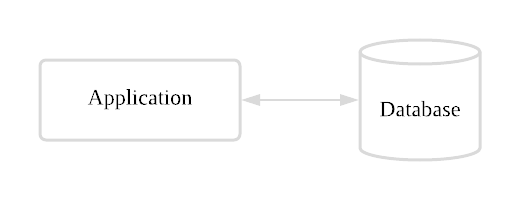
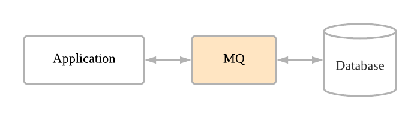

# MQ(Message Queue)란?

웹 서버를 구성하게 되면 성능에 대한 고려는 빼먹을 수 없다. 데이터 처리를 하다보면 너무 많은 처리로 인해 대기하는 요청이 쌓이게 된다. 이로 인해 서버의 성능이 저하되고, 최악의 경우에는 서버가 다운되는 상황까지 직면하게 된다.             

이런 상황을 방지하기 위해 서버사이드에서는 로드 밸런싱을 하기도 하고, DB사이드에서는 H/A, A/A 방식으로 구성을 하기도 한다. 하지만 이러한 방식은 비용도 많이 들고 무엇보다 DB사이드에서의 구성은 쉽지 않다. 이에 대한 대안으로 우리는 **비동기 메시지 처리 방식**을 택하게 된다.

### MQ Message Queue
**메시지 큐(Message Queue: MQ)**는 프로세스 또는 프로그램 인스턴스가 데이터를 서로 교환할 때 사용하는 통신 방법이다. 더 큰 개념으로는 **메시지 지향 미들웨어(Message Oriented Middleware: MOM)**를 구현한 시스템을 의미한다. 여기서 MOM은 비동기 메시지를 사용하는 응용 프로그램 간의 데이터 송수신을 말한다. MQ는 별도의 공정 작업을 연기할 수 있는 유연성을 제공하여 SOA(Service-Oriented Architecture)의 개발에 도움을 줄 수 있다.   

> #### 용어정리
> * 메시지 지향 미들웨어(Message Oriented Middleware: MOM)
>   * 분산 시스템 간 메시지를 주고 받는 기능을 제공하는 소프트웨어나 하드웨어 인프라
> * 메시지 큐(Message Queue: MQ)
>   * MOM을 구현한 시스템
> * 브로커(Broker)
>   * Message Queue 시스템
> * AMQP(Advanced Message Queueing Protocol)
>   * 메시지 지향 미들웨어를 위한 프로토콜

 

### 왜 사용하게 되었나?

먼저, MessageQueue 미사용/사용 웹 서비스 구조의 예시를 보자.

#### 어플리케이션과 데이터베이스의 동기적 직접통신 구조
                

어플리케이션과 DB가 강하게 결합되어 있어 어플리케이션의 요청&응답 과정에서 DB 서버로의 요청&응답 모두 완료되어야 응답이 가능하다. 이렇게 Client와 동기방식으로 많은 데이터 통신을 하게 되면 다음과 같은 문제가 발생할 수 있다. 

1. DB의 응답 시간이 길어진다면 어플리케이션 또한 그만큼 응답시간이 길어진다.
2. DB 장애시 어플리케이션이 동작하지 못한다.
3. 어플리케이션 입장에서 감당할 수 있는 요청 수가 DB에서는 감당 불가능하다면(병목현상), 성능저하나 장애가 발생할 수 있다.

이런 현상을 방지하고자 우리는 또 하나의 미들웨어에 메시지를 위임하여 요청을 순차적으로 처리하게 된다. 

#### MQ를 통한 어플리케이션과 데이터베이스의 통신
                

어플리케이션은 큐에 요청을 쌓고, DB는 큐의 요청을 꺼내 처리한다. 

1. 어플리케이션은 큐에 요청을 보내고, DB의 응답을 기다리지 않고 응답을 보낼 수 있다.
2. DB 장애 발생시에도 어플리케이션은 독립적으로 동작이 가능하다.
3. 어플리케이션과 DB 사이의 통신을 처리량에 따라 제어할 수 있다.

 

### 메시지 큐의 장점
* 비동기(Asynchronous): Queue에 넣기 때문에 나중에 처리할 수 있다.
* 비동조(Decoupling): Application과 분리할 수 있다.
* 탄력성(Resilience): 일부가 실패 시 전체에 영향을 받지 않는다.
* 과잉(Redundancy): 실패할 경우 재실행이 가능하다.
* 보증(Guarantees): 작업이 처리된걸 확인할 수 있다.
* 확장성(Scalable): 다수의 프로세스들이 큐에 메시지를 보낼 수 있다.

 

### 메시지 큐를 지원하는 API 및 미들웨어

#### Spring Integration
: 스프링 기반의 메시지 처리 모듈

* 장점
  * 스프링 기반이기 때문에 스프링에 쉽게 적용이 가능하다.
  * TaskExcutor를 이용한 단순한 구조
* 단점
  * 확장성 부족(로드밸런싱, 클러스터링 불가능)
  * 시스템 에러 시 데이터 유실
  * 모니터링 도구 없음

#### JMS
: J2EE에서 지원하는 메시지 처리 API

* 단점
  * JAVA 전용(AMQP 지원하지 않음)
  * 모니터링 도구 없음

#### ActiveMQ
: Java로 만든 오픈소스 메시지 브로커

* 장점
  * 다양한 언어 지원
  * STOMP를 통해서도 접근 가능
  * JDBC를 사용하여 매우 빠른 Persistence 지원
  * 클러스터링 가능
  * REST API를 통해 웹 기반 메시징 지원
  * ajax 를 통해 순수한 DHTML을 사용한 웹스트리밍 지원 
* 단점
  * 모니터링 도구 없음

#### RabbitMQ
: AMQP를 지원하는 오픈소스 메시징 시스템

* 장점
  * 실시간 모니터링 및 관리 용이
  * 다양한 언어 지원
  * 클러스터링 가능

* 단점
  * Window OS 의 경우 Erlang, OpenSSL 설치 필요

#### Kafka
: 대용량 실시간 로그 처리에 특화되어 설계된 메시지 시스템

* 장점
  * AMQP나 JMS를 사용하지 않고 단순 메시지 헤더를 지닌 TCP 통신
  * 개별 전송이 아닌 다수 전송 가능(Batch 처리 가능)
  * 파일 시스템에 저장(데이터의 영속성 보장)
  * 대기 중인 메시지로 인한 시스템 성능 감소 줄임
  * 분산 시스템이 기본적으로 설계
* 단점
  * 큐의 기능은 기존 JMS나 Broker보다 부족

 
 
 

## Reference

* https://lion-king.tistory.com/entry/MessageQueue-MQ-what-is
* https://blog.naver.com/PostView.nhn?blogId=dktmrorl&logNo=222117711303&categoryNo=0&parentCategoryNo=0&viewDate=&currentPage=1&postListTopCurrentPage=1&from=postView
* https://heowc.tistory.com/35